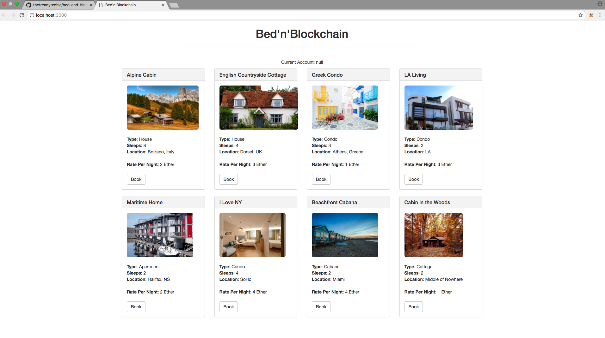

# Bed'n'Blockchain
***A simple decentralized booking system dapp built with Solidity and Truffle.***

## Tools Required:

Before you clone this repo, ensure you have the following tools installed:

* Solidity
* Ganache
* Truffle
* Node Package Manager
* Node.js
* MetaMask

For full setup instructions, read the [instructions here]('setup-instructions.md')

## Running the dapp:

Upon cloning the repo, cd into the directory using your terminal/command line and run:
	
	npm install

This will install the required dependencies.

Then, launch Ganache and ensure it is running on localhost:7545. In your terminal/command line, run:

	truffle migrate --network development 
	
If you have already done this in the past, you will need to run the following command instead to redeploy and overwrite the previous contract's logs:

	truffle migrate --compile-all --reset --network development

This will compile the files and deploy the contract to the network.

Now you are ready to launch the dapp. This dapp uses Lite Server to run in the browser. Run the following:

	 npm run dev 
	 
Your dapp should open a browser to localhost, and you should see the following:

If you receive an error that refers to lite-server, delete the node_modules/lite-server subdirectory and run: 

	npm install lite-server

This should force the install and configuration. If you receive another error, delete the node_modules and build subdirectories and rerun the above commands. 

